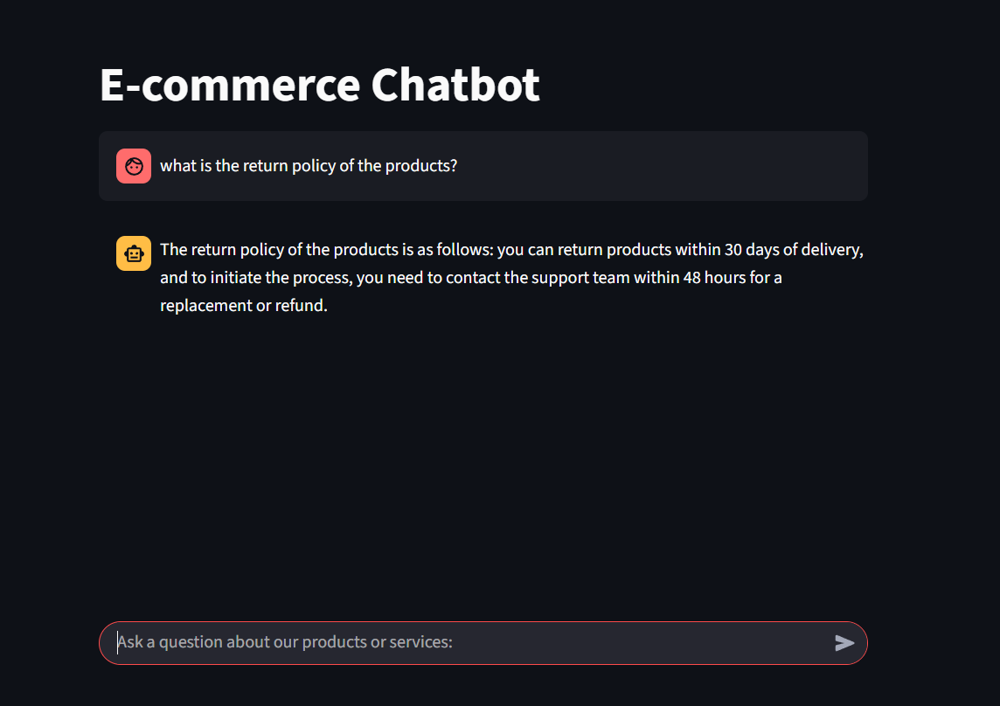
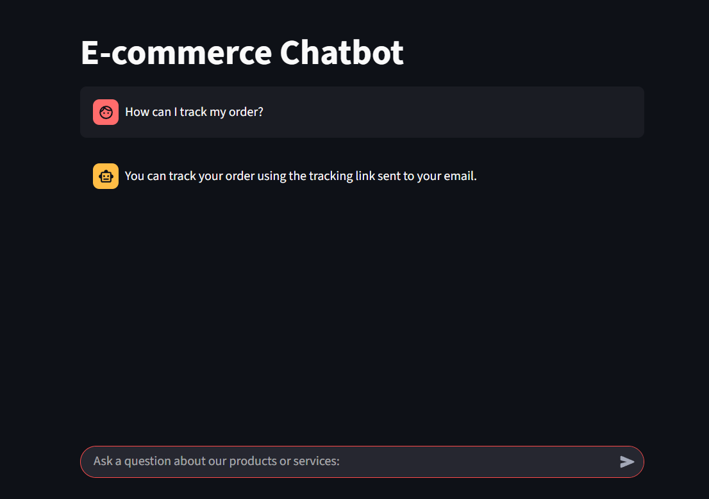
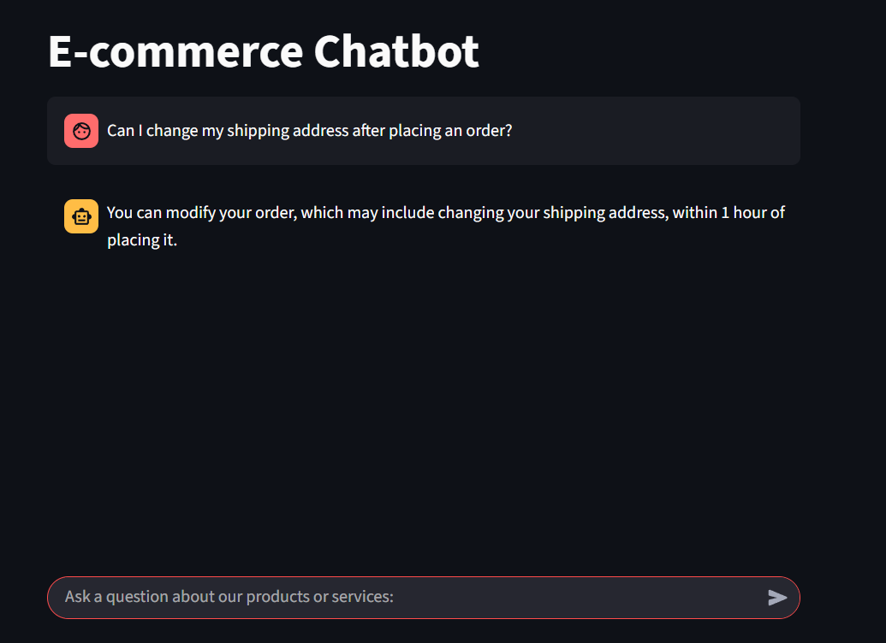

E-commerce Chatbot

Project Overview

This project aims to develop an AI-powered chatbot for Flipkart's e-commerce platform. The chatbot assists users with frequently asked questions (FAQs) and product inquiries, enhancing user engagement and satisfaction. By leveraging generative AI, the chatbot provides instant, accurate responses, improving the overall shopping experience.

Architecture

1. FAQ Handling

Data Ingestion: FAQs are ingested into Chromadb, a vector database, for efficient storage and retrieval.

Query Processing: User queries are vectorized and matched against the FAQ database to find the most relevant answers.

2. Product Inquiries

Data Collection: Product data is scraped from Flipkart using Python and Selenium, capturing details like brand, price, discount, average rating, and total ratings.
Data Storage: Scraped data is cleaned and stored in an SQLite database.

Query Handling: User product queries are processed using the LLama3.3 LLM to generate SQL queries, which are executed against the SQLite database to retrieve relevant information.

3. Chatbot Interface

Frontend: Built with Streamlit, providing an interactive and user-friendly interface.

Routing: A semantic router directs user queries to either the FAQ system or the product inquiry system based on the query's intent.

Technologies Used

-LLama3.3 LLM: , Natural language understanding and generation

Streamlit: Interactive frontend interface

Chromadb: Vector database for FAQ storage

SQLite: Relational database for product data

Python with Selenium: Web scraping for data collection

Semantic Router: Intelligent query routing

##Setup and Usage

Clone the Repository:

git clone https://github.com/lionel-richy/E-commerce-Chatbot

Install Dependencies:

pip install -r requirements.txt

Configure Databases:

Initialize Chromadb with FAQ data.

Populate SQLite with product data by running the web scraping script.

Run the Chatbot:

streamlit run mainApp.py

Screenshots

Challenges and Solutions

Data Cleaning: Inconsistent data formats during web scraping posed challenges. I implemented validation and cleaning steps to ensure data integrity.

Query Routing: Accurately distinguishing between FAQ and product inquiries required fine-tuning the semantic router. I used intent classification techniques to improve accuracy.

Further Reading

ChromaDB Documentation

Streamlit Documentation

LLama3.3 LLM Resources

Contact

For questions or collaboration opportunities, feel free to reach out:

Email: [panlaprichy@gmail.com]

LinkedIn: [https://www.linkedin.com/in/lionel-panlap/]